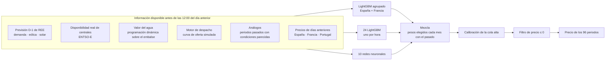

# Previsión del precio del mercado diario de España

Un modelo abierto que predice, cada mañana y **antes de que cierre la subasta
de OMIE a las 12:00**, el precio de los 96 periodos de 15 minutos del día
siguiente en el mercado diario español. Las previsiones se publican aquí, se
evalúan solas contra el precio real y cualquiera puede proponer cómo mejorarlo.

*English summary [below](#in-english).*

## Resultados

**Backtest** (walk-forward mensual: cada mes se predice con un modelo entrenado
solo con los meses anteriores y con información disponible antes del cierre de
la subasta):

| | MAE (EUR/MWh) |
|---|---:|
| Por periodo de casación | **9,98** |
| Media del día (días completos de 15 minutos) | **6,42** |
| Referencia ingenua (mismo periodo del día anterior) | 18,25 |

37.486 periodos, del 1 de abril de 2025 al 15 de septiembre de 2026. La
predicción periodo a periodo está en
[`previsiones/walkforward/espana_referencia.csv`](previsiones/walkforward/espana_referencia.csv).

**Una corrección antes de publicar.** Al preparar este repositorio apareció una
fuga en el backtest: el valor del agua se calculaba con una superficie estimada
sobre toda la historia, así que cada mes del pasado usaba precios y aportaciones
de meses posteriores. Ahora se reestima en cada mes solo con las semanas ya
publicadas ([`agua_causal.py`](studies/precio_da_conjunto/agua_causal.py)). En
los mismos periodos, el error pasa de 9,97 a 10,03: la fuga valía 0,07 EUR/MWh.
La cifra de arriba es la corregida. La previsión diaria no tenía el problema,
porque en ella la superficie se estima con los datos disponibles ese día.

**Diez variables, ningún dato nuevo (2026-09-13).** Una auditoría del dataset
contra lo que el modelo consumía, más una revisión de la literatura de previsión
de precio eléctrico centrada en variables de entrada y no en métodos, dejaron
diez que bajan el error de forma clara — y **ninguna añade un dato que no
estuviera ya ahí**: son combinaciones y transformaciones de series que el modelo
tenía delante. Dos (`reserve_margin_mw`, el margen de reserva del sistema, y
`ratio_renovable_periodo`) ya se construían y nunca se habían conectado. Las
otras ocho las añade
[`features_v3.py`](studies/precio_da_mejor_modelo/features_v3.py): el componente
estacional de largo plazo, la variación de las previsiones respecto a ayer, y la
tensión del sistema francés. **Sobre los mismos periodos, el error baja 0,65** (IC95
[−0,69, −0,60]; mejora el 67,6 % de los días).

**Y una fuga encontrada al comprobar ese resultado (2026-09-13).** Al comparar
esta implementación contra la privada del mismo modelo salió una diferencia de
0,49 EUR/MWh a favor de esta, que es demasiado para dos versiones del mismo
diseño. La causa: el día de mercado se calculaba con la fecha **UTC**, y el
mercado español opera en CET/CEST. En el **93,4 %** de las filas
`price_boundary_prev_day` entregaba un precio del propio día de mercado — fijado
en la misma subasta que se predecía — y el calendario entero iba en UTC.
Corregido en [`dia_mercado.py`](studies/precio_da_mejor_modelo/dia_mercado.py),
aplicado tanto al backtest como a la previsión diaria. **La fuga valía 0,69
EUR/MWh**; medida de forma independiente en la implementación privada dio 0,68.
Las cifras de arriba son las corregidas.

**`margen_neto`, una variable más (2026-09-14).** Buscando qué más podía
bajar el error entre las que el modelo ya tenía delante, `reserve_margin_mw`
(la holgura del sistema español) y `tension_fr` (cuánto tira Francia por la
interconexión) resultaron ser, juntas, más que la suma de lo que aportan
por separado: la resta de las dos, `margen_neto`, es la única variable
nueva de esta ronda. Mismo argumento que las diez de arriba — un árbol no
aproxima bien una diagonal con splits por eje, dársela ya restada le ahorra
ese trabajo — y el mismo cero riesgo de fuga, porque las dos columnas que
resta ya estaban ahí. **El error baja de 10,10 a 10,00** (la ventana de
evaluación también creció dos días desde la última medición, así que no es
una comparación aislada sobre los mismos periodos como las de arriba). El
efecto se concentra en episodios de tensión real de sistema, que no ocurren
todos los meses — detalle en `features_v3.py`.

**Meteorología multipunto (2026-09-15), la única variable con dato nuevo de
toda esta ronda.** El resto de mejoras de más arriba son combinaciones de lo
que el modelo ya tenía; esta no — `weather.duckdb` en este repositorio solo
traía un punto para España (Madrid, heredado de cuando se creó el
repositorio), y el viento en Madrid no dice nada del que ven los
aerogeneradores en Galicia o Aragón. Se añaden 26 variables de
viento/radiación/temperatura en 10 puntos elegidos por dónde está el recurso
eólico y solar (A Coruña, Burgos-Soria, Zaragoza, Navarra, Tarifa, Albacete ·
Badajoz, Sevilla-Córdoba, Ciudad Real, Murcia), descargadas en vivo de la API
gratuita de Open-Meteo — sin clave, con caché de un día para no repetir la
descarga en cada uno de los cortes mensuales del walk-forward. **El error baja
de 10,00 a 9,98** — mucho más modesto que el −0,09 a −0,17 medido en la
implementación privada equivalente, aunque las 26 variables sí correlacionan
con el precio en el signo esperado (más sol o más viento, precio más bajo).
Se mantiene: el criterio del proyecto es el MAE agregado, y bajó.

**Las previsiones diarias anteriores al 2026-09-13** que hay en
[`previsiones/diarias/`](previsiones/diarias/) se generaron con esa fuga: el
script en vivo reconstruye los desfases y el calendario por su cuenta y
arrastraba el mismo fallo. Se dejan tal cual, con su commit y su hora, porque
borrarlas sería peor; a partir del 2026-09-13 son limpias.

Por qué funcionan, que es lo mismo en los tres bloques: un modelo de árboles
necesita muchísimos cortes para aproximar una suma de nueve columnas o una
diferencia entre dos, así que dárselas hechas le ahorra un trabajo que hacía
mal. No es información nueva, es estructura.

**En vivo:** [`resultados/`](resultados/README.md) se actualiza cada día con el
error de las previsiones publicadas, y [`previsiones/diarias/`](previsiones/diarias/)
guarda cada una tal y como salió. La hora del commit demuestra que se publicó
antes de conocer el precio.

## Cómo funciona



Algunas decisiones que explican el resultado:

- **La hidráulica entra como precio, no como cantidad.** La hidráulica de
  embalse no produce una cantidad fija: oferta a un precio que refleja lo que
  vale guardar el agua. Modelarla así, con una programación dinámica sobre el
  nivel de los embalses, fue la mayor mejora del motor de despacho.
- **Análogos por periodo.** Para cada cuarto de hora se buscan los periodos
  pasados con la demanda, la renovable, el gas y el valor del agua más
  parecidos a los previstos. Es la variable más importante del modelo.
- **España y Francia se entrenan juntas.** Comparten historia en un único
  modelo agrupado; a España le baja el error frente a entrenarla sola.
- **Tres familias de modelos que se equivocan distinto.** Los árboles no
  extrapolan y las redes sí; la mezcla aprovecha que sus errores no coinciden.
- **Calibración de la cola.** Entrenar con error cuadrático encoge las
  predicciones hacia el centro; una recta a la mediana, ajustada solo con el
  pasado, corrige los precios altos.

## Qué hay en el repositorio

| Carpeta | Qué contiene |
|---|---|
| `etl/` | Descarga y actualización de cada fuente en bases DuckDB locales |
| `studies/` | El modelo, en el orden de la cadena: valor del agua (`c3_valor_agua`), motor de despacho (`merit_order`, `merit_order_francia`), variables D-1 (`precio_da_mejor_modelo`, `precio_da_francia`), walk-forward y mezcla (`precio_da_conjunto`; el backtest de referencia es `agua_causal.py`), predicción del día siguiente (`prediccion_live`) |
| `scripts/` | Lo que se ejecuta: reconstruir, predecir, evaluar, comparar una propuesta, exportar |
| `previsiones/` | La predicción de referencia del backtest y cada previsión diaria publicada |
| `resultados/` | La evaluación de lo publicado |

Los comentarios del código citan a veces `findings.md #NNN`: es el cuaderno de
investigación del proyecto original, donde está el detalle de cada decisión.

## Reproducirlo

```
python -m venv .venv && .venv\Scripts\activate
pip install -r requirements.txt
copy .env.example .env                 # dos tokens gratuitos: ENTSO-E y e·sios
python -m scripts.construir_bases      # las bases DuckDB desde 2023 (horas, sobre todo ENTSO-E)
python -m scripts.reconstruir          # variables + walk-forward causal (~1,5 h)
python -m scripts.prevision_diaria     # previsión de mañana (~7 min)
```

Para experimentar no hace falta montar las bases. Cada
[release](../../releases) trae los datasets ya construidos: el de hoy de España
y Francia, y uno por mes de corte del walk-forward causal. Deja los ficheros en
`dist/` y:

```
python -m scripts.completar_materias_primas              # añade gas, CO₂ y carbón (no se pueden redistribuir)
python -m studies.precio_da_conjunto.agua_causal walkforward   # rehace el backtest de referencia
```

## Proponer una mejora

Lo que se busca es **bajar el MAE agregado**, y es el único criterio. Abre un
[issue de propuesta](../../issues/new?template=propuesta.yml) con la idea, o un
pull request con el código y la salida de:

```
python -m scripts.comparar tu_prediccion.csv
```

que la mide contra la referencia sobre los mismos periodos, sin reentrenar
nada. Las reglas de medida están en [CONTRIBUTING.md](CONTRIBUTING.md).

## Datos y licencia

El código es **MIT**. Los datos conservan las condiciones de cada fuente (OMIE,
Red Eléctrica, ENTSO-E, SMARD, Open-Meteo) y, en conjunto, son para uso **no
comercial** citando las fuentes. Las series de Yahoo Finance no se
redistribuyen. Detalle en [DATOS.md](DATOS.md).

La idea de publicar las previsiones para que otros puedan medirse contra ellas
sin reentrenar viene de [epftoolbox](https://github.com/jeslago/epftoolbox)
(Lago, Marcjasz, De Schutter y Weron, *Forecasting day-ahead electricity
prices: A review of state-of-the-art algorithms, best practices and an
open-access benchmark*, Applied Energy, 2021).

## Autor

Jorge Sánchez Cava · [portfolio](https://jorgescava-maker.github.io/mercado-diario/) ·
jorge.s.cava@gmail.com

---

## In English

An open model that forecasts, every morning **before OMIE's 12:00 auction
gate closure**, the price of the 96 fifteen-minute periods of the next day in
the Spanish day-ahead market. Forecasts are committed here (the commit time
proves they were made ex ante) and scored automatically against the real
price in [`resultados/`](resultados/README.md).

Backtest (monthly walk-forward, ex-ante information only): **MAE 9.98 EUR/MWh
per period, 6.42 on the daily average** (naive same-period-yesterday: 18.25),
over 37,486 periods from 1 April 2025 to 15 September 2026. While preparing
this repository we found and fixed a leak: the reservoir water value was
estimated on the full history; it is now re-estimated each month with past
weeks only (`agua_causal.py`), which costs 0.07 EUR/MWh. Two later additions:
`margen_neto` (the system's own reserve margin minus how hard France is
pulling through the interconnector — both already in the model, just never
subtracted from each other) brought it from 10.10 to 10.00; multi-point
weather (26 wind/radiation/temperature variables at 10 Spanish locations
chosen by where the wind and solar resource actually is, not Madrid —
the only genuinely new data in this whole round) brought it from 10.00 to
9.98.

The model is a blend of a LightGBM trained jointly on Spain and France, 24
hourly LightGBMs and 10 neural networks, fed by the grid operator's D-1
forecasts, real plant availability, a water-value dynamic programme for
reservoir hydro, a merit-order engine and analog periods. Improvement
proposals are welcome: the only criterion is lowering the aggregate MAE, and
`scripts/comparar.py` measures any candidate against the stored production
forecast without retraining. Code is MIT; data keeps each source's terms
(non-commercial use overall) — see [DATOS.md](DATOS.md).
