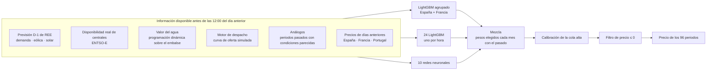

# Previsión del precio del mercado diario de España

Un modelo abierto que predice, cada mañana y **antes de que cierre la subasta
de OMIE a las 12:00**, el precio de los 96 periodos de 15 minutos del día
siguiente en el mercado diario español. Las previsiones se publican aquí, se
evalúan solas contra el precio real y cualquiera puede proponer cómo mejorarlo.

*English summary [below](#in-english).*

## Resultados

**Backtest** (walk-forward mensual: cada mes se predice con un modelo entrenado
solo con los meses anteriores y con información disponible antes del cierre de
la subasta):

| | MAE (EUR/MWh) |
|---|---:|
| Por periodo de casación | **10,03** |
| Media del día (días completos de 15 minutos) | **6,27** |
| Referencia ingenua (mismo periodo del día anterior) | 18,17 |

37.006 periodos, del 1 de abril de 2025 al 10 de septiembre de 2026. La
predicción periodo a periodo está en
[`previsiones/walkforward/espana_referencia.csv`](previsiones/walkforward/espana_referencia.csv).

**Una corrección antes de publicar.** Al preparar este repositorio apareció una
fuga en el backtest: el valor del agua se calculaba con una superficie estimada
sobre toda la historia, así que cada mes del pasado usaba precios y aportaciones
de meses posteriores. Ahora se reestima en cada mes solo con las semanas ya
publicadas ([`agua_causal.py`](studies/precio_da_conjunto/agua_causal.py)). En
los mismos periodos, el error pasa de 9,97 a 10,03: la fuga valía 0,07 EUR/MWh.
La cifra de arriba es la corregida. La previsión diaria no tenía el problema,
porque en ella la superficie se estima con los datos disponibles ese día.

**En vivo:** [`resultados/`](resultados/README.md) se actualiza cada día con el
error de las previsiones publicadas, y [`previsiones/diarias/`](previsiones/diarias/)
guarda cada una tal y como salió. La hora del commit demuestra que se publicó
antes de conocer el precio.

## Cómo funciona



Algunas decisiones que explican el resultado:

- **La hidráulica entra como precio, no como cantidad.** La hidráulica de
  embalse no produce una cantidad fija: oferta a un precio que refleja lo que
  vale guardar el agua. Modelarla así, con una programación dinámica sobre el
  nivel de los embalses, fue la mayor mejora del motor de despacho.
- **Análogos por periodo.** Para cada cuarto de hora se buscan los periodos
  pasados con la demanda, la renovable, el gas y el valor del agua más
  parecidos a los previstos. Es la variable más importante del modelo.
- **España y Francia se entrenan juntas.** Comparten historia en un único
  modelo agrupado; a España le baja el error frente a entrenarla sola.
- **Tres familias de modelos que se equivocan distinto.** Los árboles no
  extrapolan y las redes sí; la mezcla aprovecha que sus errores no coinciden.
- **Calibración de la cola.** Entrenar con error cuadrático encoge las
  predicciones hacia el centro; una recta a la mediana, ajustada solo con el
  pasado, corrige los precios altos.

## Qué hay en el repositorio

| Carpeta | Qué contiene |
|---|---|
| `etl/` | Descarga y actualización de cada fuente en bases DuckDB locales |
| `studies/` | El modelo, en el orden de la cadena: valor del agua (`c3_valor_agua`), motor de despacho (`merit_order`, `merit_order_francia`), variables D-1 (`precio_da_mejor_modelo`, `precio_da_francia`), walk-forward y mezcla (`precio_da_conjunto`; el backtest de referencia es `agua_causal.py`), predicción del día siguiente (`prediccion_live`) |
| `scripts/` | Lo que se ejecuta: reconstruir, predecir, evaluar, comparar una propuesta, exportar |
| `previsiones/` | La predicción de referencia del backtest y cada previsión diaria publicada |
| `resultados/` | La evaluación de lo publicado |

Los comentarios del código citan a veces `findings.md #NNN`: es el cuaderno de
investigación del proyecto original, donde está el detalle de cada decisión.

## Reproducirlo

```
python -m venv .venv && .venv\Scripts\activate
pip install -r requirements.txt
copy .env.example .env                 # dos tokens gratuitos: ENTSO-E y e·sios
python -m scripts.construir_bases      # las bases DuckDB desde 2023 (horas, sobre todo ENTSO-E)
python -m scripts.reconstruir          # variables + walk-forward causal (~1,5 h)
python -m scripts.prevision_diaria     # previsión de mañana (~7 min)
```

Para experimentar no hace falta montar las bases. Cada
[release](../../releases) trae los datasets ya construidos: el de hoy de España
y Francia, y uno por mes de corte del walk-forward causal. Deja los ficheros en
`dist/` y:

```
python -m scripts.completar_materias_primas              # añade gas, CO₂ y carbón (no se pueden redistribuir)
python -m studies.precio_da_conjunto.agua_causal walkforward   # rehace el backtest de referencia
```

## Proponer una mejora

Lo que se busca es **bajar el MAE agregado**, y es el único criterio. Abre un
[issue de propuesta](../../issues/new?template=propuesta.yml) con la idea, o un
pull request con el código y la salida de:

```
python -m scripts.comparar tu_prediccion.csv
```

que la mide contra la referencia sobre los mismos periodos, sin reentrenar
nada. Las reglas de medida están en [CONTRIBUTING.md](CONTRIBUTING.md).

## Datos y licencia

El código es **MIT**. Los datos conservan las condiciones de cada fuente (OMIE,
Red Eléctrica, ENTSO-E, SMARD, Open-Meteo) y, en conjunto, son para uso **no
comercial** citando las fuentes. Las series de Yahoo Finance no se
redistribuyen. Detalle en [DATOS.md](DATOS.md).

La idea de publicar las previsiones para que otros puedan medirse contra ellas
sin reentrenar viene de [epftoolbox](https://github.com/jeslago/epftoolbox)
(Lago, Marcjasz, De Schutter y Weron, *Forecasting day-ahead electricity
prices: A review of state-of-the-art algorithms, best practices and an
open-access benchmark*, Applied Energy, 2021).

## Autor

Jorge Sánchez Cava · [portfolio](https://jorgescava-maker.github.io/mercado-diario/) ·
jorge.s.cava@gmail.com

---

## In English

An open model that forecasts, every morning **before OMIE's 12:00 auction
gate closure**, the price of the 96 fifteen-minute periods of the next day in
the Spanish day-ahead market. Forecasts are committed here (the commit time
proves they were made ex ante) and scored automatically against the real
price in [`resultados/`](resultados/README.md).

Backtest (monthly walk-forward, ex-ante information only): **MAE 10.03 EUR/MWh
per period, 6.27 on the daily average** (naive same-period-yesterday: 18.17),
over 37,006 periods from 1 April 2025 to 10 September 2026. While preparing
this repository we found and fixed a leak: the reservoir water value was
estimated on the full history; it is now re-estimated each month with past
weeks only (`agua_causal.py`), which costs 0.07 EUR/MWh.

The model is a blend of a LightGBM trained jointly on Spain and France, 24
hourly LightGBMs and 10 neural networks, fed by the grid operator's D-1
forecasts, real plant availability, a water-value dynamic programme for
reservoir hydro, a merit-order engine and analog periods. Improvement
proposals are welcome: the only criterion is lowering the aggregate MAE, and
`scripts/comparar.py` measures any candidate against the stored production
forecast without retraining. Code is MIT; data keeps each source's terms
(non-commercial use overall) — see [DATOS.md](DATOS.md).
