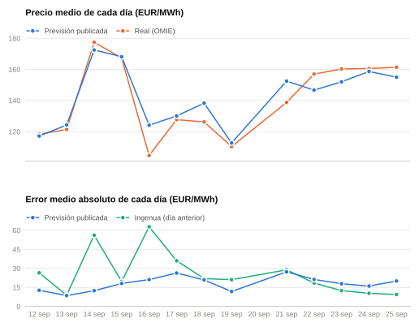
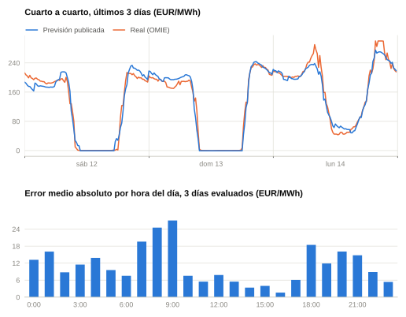

# Resultados de la previsión publicada

Se actualiza sola cada día. Cada previsión se publica antes del cierre de la
subasta (12:00, hora peninsular) y se evalúa cuando OMIE publica el precio real.

- Días evaluados: **4** (2026-09-12 → 2026-09-15)
- MAE por periodo, todo el histórico publicado: **12,90 EUR/MWh** (ingenua del día anterior: 27,74)
- MAE de la media diaria: **2,45 EUR/MWh**

## Por día

<picture>
  <source media="(prefers-color-scheme: dark)" srcset="grafico_diario_oscuro.svg">
  
</picture>

## Por hora

<picture>
  <source media="(prefers-color-scheme: dark)" srcset="grafico_horario_oscuro.svg">
  
</picture>

Arriba, la última semana cuarto a cuarto; abajo, en qué horas del día se
equivoca más, con todos los días evaluados.

## Últimos 30 días

| Día | Periodos | MAE | Ingenua | Media real | Media prevista |
|---|---:|---:|---:|---:|---:|
| 2026-09-15 | 96 | 18,05 | 19,60 | 167,38 | 168,16 |
| 2026-09-14 | 96 | 12,38 | 56,09 | 177,48 | 172,50 |
| 2026-09-13 | 96 | 8,52 | 8,81 | 121,39 | 124,28 |
| 2026-09-12 | 96 | 12,67 | 26,48 | 118,28 | 117,13 |

Detalle completo: [`evaluacion_diaria.csv`](evaluacion_diaria.csv) (por día) y [`evaluacion_periodos.csv`](evaluacion_periodos.csv) (por periodo).
